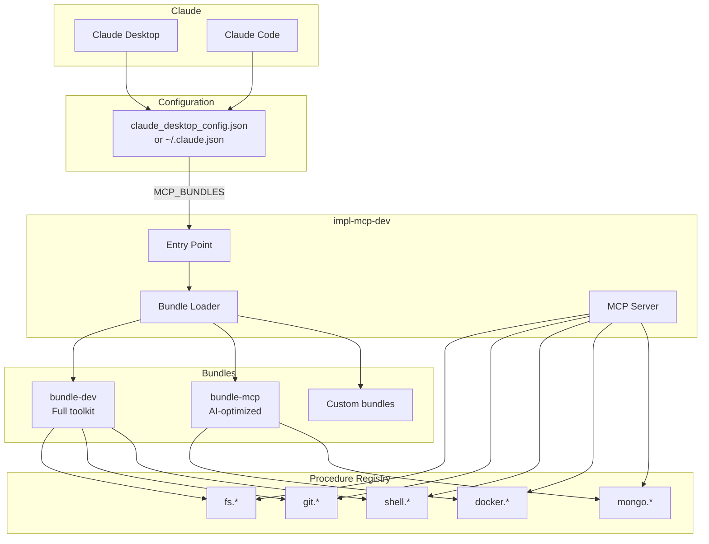
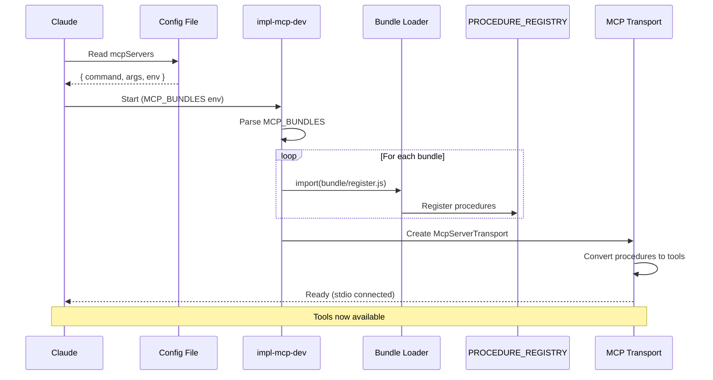
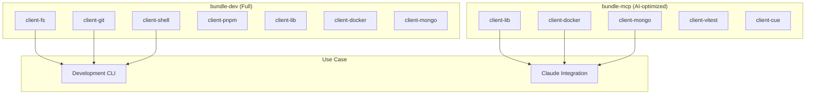

# @mark1russell7/impl-mcp-dev

[](https://opensource.org/licenses/MIT)
[](https://www.typescriptlang.org/)
[](https://nodejs.org/)
[](https://modelcontextprotocol.io/)

> Ready-to-use MCP server exposing the procedure ecosystem to Claude Desktop and Claude Code.

## Table of Contents

- [Overview](#overview)
- [Quick Start](#quick-start)
- [Architecture](#architecture)
- [Claude Desktop Setup](#claude-desktop-setup)
- [Claude Code Setup](#claude-code-setup)
- [Configuration](#configuration)
- [Available Tools](#available-tools)
- [How It Works](#how-it-works)
- [Troubleshooting](#troubleshooting)
- [Requirements](#requirements)
- [License](#license)

---

## Overview

**impl-mcp-dev** is the ready-to-run MCP server for the Mark ecosystem:

- **Zero Configuration** - Works out of the box with sensible defaults
- **Dynamic Bundle Loading** - Configure which procedure bundles to expose
- **Claude Integration** - Works with both Claude Desktop and Claude Code
- **Debug Mode** - Detailed logging for troubleshooting

---

## Quick Start

```bash
npx @mark1russell7/impl-mcp-dev
```

---

## Architecture

### System Overview



### Startup Flow



### Bundle Composition



---

## Claude Desktop Setup

### Step 1: Locate Configuration File

**Windows:** `%APPDATA%\Claude\claude_desktop_config.json`
**macOS:** `~/Library/Application Support/Claude/claude_desktop_config.json`

### Step 2: Add MCP Server Configuration

```json
{
  "mcpServers": {
    "dev-tools": {
      "command": "npx",
      "args": ["@mark1russell7/impl-mcp-dev"],
      "env": {
        "MCP_BUNDLES": "@mark1russell7/bundle-mcp"
      }
    }
  }
}
```

### Step 3: Restart Claude Desktop

Quit and reopen Claude Desktop. Tools will appear in Claude's tool list.

---

## Claude Code Setup

### Add to ~/.claude.json

```json
{
  "projects": {
    "C:/Users/YOUR_USERNAME/git": {
      "mcpServers": {
        "dev-tools": {
          "type": "stdio",
          "command": "node",
          "args": ["C:/Users/YOUR_USERNAME/git/impl-mcp-dev/dist/server.js"],
          "env": {
            "MCP_BUNDLES": "@mark1russell7/bundle-mcp",
            "MONGODB_URI": "mongodb://localhost:27017"
          }
        }
      }
    }
  }
}
```

### Verify Connection

Run `/mcp` in Claude Code to see connected servers.

---

## Configuration

### Environment Variables

| Variable | Default | Description |
|----------|---------|-------------|
| `MCP_BUNDLES` | `@mark1russell7/bundle-dev` | Comma-separated list of bundles to load |
| `MCP_SERVER_NAME` | `impl-mcp-dev` | Server name for MCP protocol |
| `MCP_SERVER_VERSION` | `1.0.0` | Server version for MCP protocol |
| `MCP_DEBUG` | `false` | Enable debug logging (outputs to stderr) |
| `MONGODB_URI` | - | MongoDB connection string (for mongo.* procedures) |

### Loading Multiple Bundles

```json
{
  "mcpServers": {
    "full-tools": {
      "command": "npx",
      "args": ["@mark1russell7/impl-mcp-dev"],
      "env": {
        "MCP_BUNDLES": "@mark1russell7/bundle-dev,@mark1russell7/bundle-mcp",
        "MCP_DEBUG": "true"
      }
    }
  }
}
```

### Local Development Setup

```json
{
  "mcpServers": {
    "dev-tools": {
      "command": "node",
      "args": ["C:/Users/me/git/impl-mcp-dev/dist/server.js"],
      "env": {
        "MCP_BUNDLES": "@mark1russell7/bundle-mcp",
        "MCP_DEBUG": "true"
      }
    }
  }
}
```

---

## Available Tools

### With bundle-mcp (Recommended for Claude)

| Namespace | Procedures | Description |
|-----------|------------|-------------|
| `cli.*` | 1 | Mark CLI wrapper |
| `lib.*` | 8 | Ecosystem management |
| `procedure.*` | 9 | Procedure management |
| `cue.*` | 5 | Configuration generation |
| `docker.*` | 12 | Docker container management |
| `mongo.*` | 16 | MongoDB operations |
| `vitest.*` | 2 | Test runner |

### With bundle-dev (Full toolkit)

Includes all of the above plus:

| Namespace | Procedures | Description |
|-----------|------------|-------------|
| `fs.*` | 15 | File system operations |
| `git.*` | 14 | Git operations |
| `shell.*` | 3 | Shell command execution |
| `pnpm.*` | 8 | Package management |

---

## How It Works

1. **Startup:** Reads `MCP_BUNDLES` environment variable
2. **Bundle Loading:** Dynamically imports each bundle's `/register.js`
3. **Procedure Registration:** Side-effect imports register procedures to `PROCEDURE_REGISTRY`
4. **MCP Transport:** `McpServerTransport` exposes procedures as MCP tools
5. **Tool Execution:** Claude calls tools → transport routes to procedure handlers

---

## Troubleshooting

### Tools not appearing in Claude

1. Check Claude Desktop logs for errors
2. Enable debug mode: `"MCP_DEBUG": "true"`
3. Verify bundles are installed: `npm ls @mark1russell7/bundle-mcp`
4. Restart Claude Desktop

### Server fails to start

1. Ensure Node.js v20+ is installed
2. Check bundle paths are correct
3. Run manually to see errors: `npx @mark1russell7/impl-mcp-dev`

### Connection issues

1. Restart Claude Desktop
2. Check `claude_desktop_config.json` syntax (valid JSON)
3. Verify `command` path is correct (`npx` should be in PATH)
4. Use absolute paths if relative paths don't work

### Debug Logging

Enable debug mode to see detailed logs:

```json
{
  "env": {
    "MCP_DEBUG": "true"
  }
}
```

Logs output to stderr and won't interfere with the MCP protocol.

---

## Requirements

- **Node.js** >= 20
- **Claude Desktop** or **Claude Code**
- **Dependencies:**
  - `@mark1russell7/client`
  - `@mark1russell7/client-mcp`
  - `@mark1russell7/mcp`
  - One or more bundle packages

---

## License

MIT
